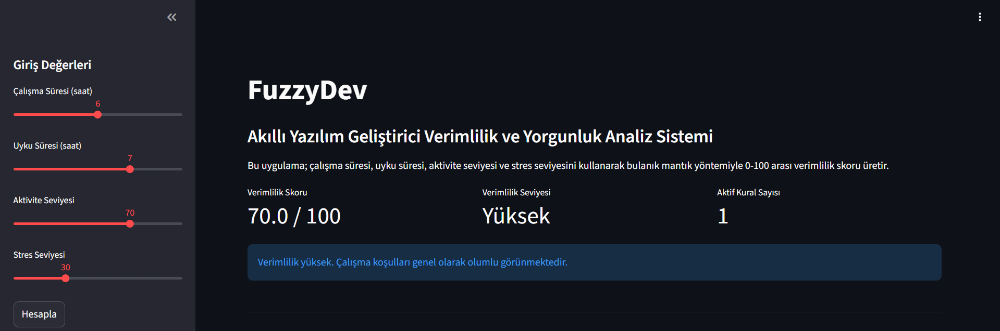
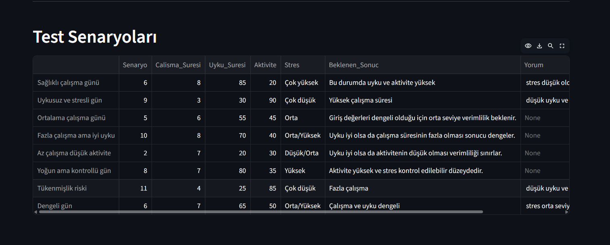

# FuzzyDev
## Akıllı Yazılım Geliştirici Verimlilik ve Yorgunluk Analiz Sistemi

### Proje Hakkında

FuzzyDev, yazılım geliştiricilerin günlük çalışma koşullarına göre verimlilik düzeylerini bulanık mantık yöntemi ile analiz eden Python tabanlı bir karar destek sistemidir.

Sistem aşağıdaki girdileri kullanmaktadır:

- Çalışma Süresi
- Uyku Süresi
- Aktivite Seviyesi
- Stres Seviyesi

Bu girdiler bulanık mantık yöntemleri kullanılarak değerlendirilir ve kullanıcı için 0–100 arası bir verimlilik skoru üretilir.

---

## Kullanılan Teknolojiler

- Python
- Scikit-Fuzzy
- NumPy
- Pandas
- Matplotlib
- Streamlit

---

## Sistem Mimarisi

### Giriş Değişkenleri

#### Çalışma Süresi (0–12 saat)

- Az
- Normal
- Fazla

#### Uyku Süresi (0–10 saat)

- Kötü
- Orta
- İyi

#### Aktivite Seviyesi (0–100)

- Düşük
- Orta
- Yüksek

#### Stres Seviyesi (0–100)

- Düşük
- Orta
- Yüksek

### Çıkış Değişkeni

Verimlilik Skoru (0–100)

Dilsel ifadeler:

- Çok Düşük
- Düşük
- Orta
- Yüksek
- Çok Yüksek

---

## Bulanık Mantık Süreci

### Bulanıklaştırma

Sistem kullanıcıdan alınan sayısal girişleri üyelik fonksiyonları ile dilsel değerlere dönüştürmektedir.

### Kural Tabanı

Projede toplam 20 adet IF–THEN kuralı kullanılmıştır.

Örnek:

```text
IF çalışma süresi = Normal
AND uyku = İyi
AND aktivite = Yüksek
AND stres = Düşük

THEN verimlilik = Çok Yüksek
```

### Çıkarım Motoru

Mamdani çıkarım yöntemi kullanılmıştır.

### Durulaştırma

Centroid (Ağırlık Merkezi) yöntemi kullanılmıştır.

---

## Arayüz Özellikleri

✔ Slider ile giriş alma

✔ Gerçek zamanlı sonuç üretme

✔ Üyelik fonksiyonlarının gösterimi

✔ Aktif kuralların listelenmesi

✔ Durulaştırılmış sonuç grafiği

✔ Test senaryoları

---

## Ekran Görüntüleri

### Ana Arayüz



---

### Üyelik Fonksiyonları


---

### Test Senaryoları



---

## Kurulum

Projeyi klonlayın:

```bash
git clone PROJE_LINKI
```

Klasöre girin:

```bash
cd FuzzyDev
```

Gerekli kütüphaneleri kurun:

```bash
pip install -r requirements.txt
```

Projeyi çalıştırın:

```bash
streamlit run app.py
```

---

## Test Sonuçları

| Çalışma | Uyku | Aktivite | Stres | Sonuç |
|----------|-------|----------|--------|--------|
|6|8|85|20|Çok Yüksek|
|9|3|30|90|Çok Düşük|
|5|6|55|45|Orta|

---

## Geliştirici

Hatice Kocatürk

GitHub:

https://github.com/haticekctrk02

LinkedIn:

https://www.linkedin.com/in/hatice-kocatürk-94b311288
